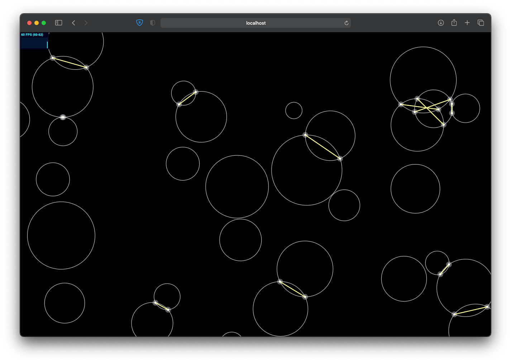

# gecs example

Examples for the [gecs](https://github.com/noahlange/gecs) ecs framework. Designed to demonstrate not only basic use of the engine, but also recommended project structure using the imaginary namespace "@gex" (short for "gecs example," oh ho ho).

Currently includes derivatives/modifications of the [ECSY circles](https://ecsy.io/examples/#Intersecting%20circles) and moving shapes examples.



To install and run:

```
git clone git@github.com:noahlange/gecs-example.git
cd gecs-example
npm i && npm start
```
